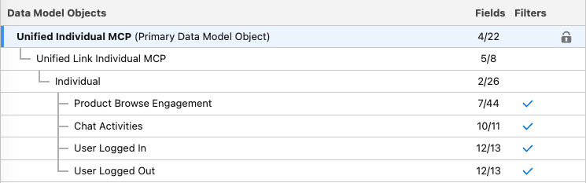

<p align="center">
<a  href="https://www.salesforce.com/"></a>
<a  href="https://www.salesforce.com/data/"></a>
<a  href="https://www.salesforce.com/ca/agentforce/"></a>
<a  href="https://www.heroku.com/"></a>
<a  href="https://getstream.io/"></a>
<a  href="https://developer.salesforce.com/docs/marketing/einstein-personalization/guide/overview.html"></a>
<p/>

# Salesforce Personalization with Agentforce and a 3rd Party Chat Service - Powered by Heroku AppLink

This project showcases how you can personalized your website based on a chat conversation you have with a Agentforce chatbot or a 3rd party chat service. The main difference between this and the [main branch](https://github.com/mvrzan/salesforce-einstein-personalization-llm) is that this branch showcases how to leverage the [Heroku AppLink](https://devcenter.heroku.com/articles/getting-started-heroku-integration?singlepage=true) integration.

# Table of Contents

- [Salesforce Personalization with Agentforce and a 3rd Party Chat Service - Powered by Heroku AppLink](#salesforce-personalization-with-agentforce-and-a-3rd-party-chat-service---powered-by-heroku-applink)
- [Table of Contents](#table-of-contents)
  - [What does it do?](#what-does-it-do)
  - [How does it work?](#how-does-it-work)
    - [Architecture diagram](#architecture-diagram)
      - [3rd Party Chat Architecture](#3rd-party-chat-architecture)
      - [Agentforce Architecture](#agentforce-architecture)
  - [Demo: Agentforce chat personalization](#demo-agentforce-chat-personalization)
  - [Demo: 3rd party chat personalization](#demo-3rd-party-chat-personalization)
  - [Demo: Initialize Data Cloud SDK](#demo-initialize-data-cloud-sdk)
  - [Demo: Initialize Agentforce chat](#demo-initialize-agentforce-chat)
  - [Technologies used](#technologies-used)
- [Configuration](#configuration)
  - [Requirements](#requirements)
  - [Setup](#setup)
    - [Local environment configuration](#local-environment-configuration)
    - [Development](#development)
    - [Salesforce environment](#salesforce-environment)
      - [Data Cloud](#data-cloud)
      - [Salesforce Connected App](#salesforce-connected-app)
      - [Salesforce Flows](#salesforce-flows)
      - [Personalization](#personalization)
      - [Prompt](#prompt)
      - [Apex Class](#apex-class)
      - [Custom Metadata Types](#custom-metadata-types)
      - [Agentforce](#agentforce)
  - [Deployment](#deployment)
    - [Can I deploy this anywhere else other than Heroku?](#can-i-deploy-this-anywhere-else-other-than-heroku)
- [Kudos](#kudos)
- [License](#license)
- [Disclaimer](#disclaimer)

---

## What does it do?

This project demonstrates how to leverage Salesforce Personalization to tailor a user’s experience based on real-time chat interactions. By integrating an Agentforce chatbot (or a third-party chat service) with Salesforce Data Cloud event streaming, the application listens for user messages in chat sessions.

The chat messages are then picked up by the Salesforce backend and (or a Heroku web server that then updates the Salesforce backend), and makes it ready for Salesforce Personalization.

When a relevant message is detected, it triggers a network call to the Salesforce Personalization which delivers individualized recommendations. This ensures that web content, product suggestions, and visual styling are dynamically adapted to each user’s conversation context, providing a customized and engaging experience.

## How does it work?

### Architecture diagram

There are two separate use cases here:

1. Example of a 3rd party chat library [getstream.io](https://getstream.io/) with real-time Salesforce Personalization
2. Example of Salesforce Agentforce chat with real-time Salesforce Personalization

The architecture is slightly different and outlined bellow.

#### 3rd Party Chat Architecture


The application flow is the following:

**Client**

1. The user navigates to the website URL
2. The browser sends a request to the hosting server, in this case that is a Heroku dyno
3. The Heroku returns HTML and Javascript, and Javascript hydrates the website
4. During the page load, the [Data Cloud Web SDK](https://developer.salesforce.com/docs/atlas.en-us.c360a_api.meta/c360a_api/c360a_api_salesforce_interactions_web_sdk.htm) also gets loaded into the website
5. Various web events get captured based on the [pre-defined web event JSON schema](./client/src/utils/data-cloud-schema.json) and custom react [useSalesforceInteractions.ts](./client/src/hooks/useSalesforceInteractions.ts) hook
6. The chat service used for this is a 3rd party library [getstream.io](https://getstream.io/)
7. As part of the website load, the chat service also gets [initialized](./client/src/components/ChatWidget/ChatCanvas.tsx)
8. Every chat message is captured by the custom [Data Cloud Web SDK event](./client/src/hooks/useSalesforceInteractions.ts#L16)
9. Additionally, on every captured chat message, a custom [notification service](./server/src/controllers/notification-service.js) endpoint gets invoked with a [deviceId](./client/src/utils/notifyAi.ts)
10. The `deviceId` is automatically generated by the Data Cloud Web SDK once the SDK is successfully loaded

**Server**

1. The web server is a [Node Express server](./server/index.js) hosted on Heroku
2. The web server uses the [Salesforce credentials](./server/.env.example) to retrieve the [authentication token](./server/src/utils/sfAuthToken.js) from Salesforce
3. With the retrieved token, a [Data Graph is invoked](./server/src/controllers/notification-service.js#23) based on the provided `deviceId`
4. The retrieved data from the Data Graph then gets [parsed](./server/src/utils/parseDataGraphData.js)
5. The parsed chat messages and the `deviceId` get send to the [Saleforce Flow via an API call](./server/src/controllers/notification-service.js#54)

**Salesforce Backend**

1. Salesforce Flow takes the provided chat messages and the `deviceId` from the API call
2. The Flow invokes a custom **Prompt**
3. The custom **Prompt** is instructed to deduce the product category based on the provided chat messages and the provided product catalog
4. Once the LLM deduces the product category, it will then return that in a specific format: `category,id`
5. The returned data gets passed back to the Salesforce Flow
6. Salesforce Flow takes the provided product category data and passes it off to a custom Apex class
7. The custom [Apex class](./salesforce/force-app/main/default/classes/sendEventEP.cls) writes the data back to the Data Cloud's real-time Data Graph

**Client Personalization**

1. The client sends a message to the Salesforce Personalization endpoint via the [Data Cloud Web SDK](./client/src/hooks/useSalesforceInteractions.ts#196)
2. The Salesforce Personalization engine queries the real-time Data Graph for latest data
3. The Salesforce Personalization engine decides what the are appropriate product recommendations
4. The client receives the product recommendations from the Salesforce Personalization endpoint
5. Finally, the client makes the [changes on the web page](./client/src/components/Body/Recommendations.tsx)

#### Agentforce Architecture


The application flow is the following:

**Client**

1. The user navigates to the website URL
2. The browser sends a request to the hosting server, in this case that is a Heroku dyno
3. The Heroku returns HTML and Javascript, and Javascript hydrates the website
4. During the page load, the [Data Cloud Web SDK](https://developer.salesforce.com/docs/atlas.en-us.c360a_api.meta/c360a_api/c360a_api_salesforce_interactions_web_sdk.htm) also gets loaded into the website
5. Various web events get captured based on the [pre-defined web event JSON schema](./client/src/utils/data-cloud-schema.json) and custom react [useSalesforceInteractions.ts](./client/src/hooks/useSalesforceInteractions.ts) hook
6. As part of the website load, the Agentforce chat also gets [initialized](./client/src/hooks/useAgentforceScript.ts)
7. The `deviceId` is automatically generated by the Data Cloud Web SDK once the SDK is successfully loaded
8. The `deviceId` is then provided to the Agentforce chat on every sent message vie the [Prechat API](./client/src/hooks/useAgentforceScript.ts#36)

**Salesforce Backend**

1. The incoming chat message from the Agentforce chat is picked up by a Salesforce Agent
2. The Salesforce Agent has a dedicated Topic assigned to it
3. The assigned Topic has an Action that invokes a Salesforce Flow
4. Salesforce Flow takes the provided chat message and the `deviceId` from the Agent Action
5. The Flow invokes a custom **Prompt**
6. The custom **Prompt** is instructed to deduce the product category based on the provided chat message and the provided product catalog
7. Once the LLM deduces the product category, it will then return that in a specific format: `category,id`
8. The returned data gets passed back to the Salesforce Flow
9. Salesforce Flow takes the provided product category data and passes it off to a custom Apex class
10. The custom [Apex class](./salesforce/force-app/main/default/classes/sendEventEP.cls) writes the data back to the Data Cloud's real-time Data Graph

**Client Personalization**

1. The client sends a message to the Salesforce Personalization endpoint via the [Data Cloud Web SDK](./client/src/hooks/useSalesforceInteractions.ts#196) once the Agentforce chatbot responds
2. The Salesforce Personalization engine queries the real-time Data Graph for latest data
3. The Salesforce Personalization engine decides what the are appropriate product recommendations
4. The client receives the product recommendations from the Salesforce Personalization endpoint
5. Finally, the client makes the [changes on the web page](./client/src/components/Body/Recommendations.tsx)

## Demo: Agentforce chat personalization


## Demo: 3rd party chat personalization


## Demo: Initialize Data Cloud SDK


## Demo: Initialize Agentforce chat


## Technologies used

**Client**

- [Vite](https://vitejs.dev/)
- [React](https://react.dev/)
- [TypeScript](https://www.typescriptlang.org/)
- [Zustand](https://github.com/pmndrs/zustand)
- [Chakra UI 3.0](https://www.chakra-ui.com/)
- [Data Cloud SDK](https://developer.salesforce.com/docs/atlas.en-us.c360a_api.meta/c360a_api/c360a_api_connect_data.htm)
- [getstream.io](https://getstream.io/)
- [Salesforce Embedded Chat](https://developer.salesforce.com/docs/atlas.en-us.snapins_web_dev.meta/snapins_web_dev/snapins_web_overview.htm)

**Server**

- [Node.js](https://nodejs.org/en)
- [Express](https://expressjs.com/)
- [JavaScript](https://developer.mozilla.org/en-US/docs/Web/JavaScript)
- [Heroku](https://www.heroku.com/)

**Salesforce**

- [Salesforce Data Cloud](https://www.salesforce.com/data/)
- [Data Cloud Data Graphs](https://help.salesforce.com/s/articleView?id=sf.c360_a_data_graphs.htm&type=5)
- [Salesforce Flows](https://help.salesforce.com/s/articleView?id=platform.flow.htm&type=5)
- [Apex](https://developer.salesforce.com/docs/atlas.en-us.apexcode.meta/apexcode/apex_intro_what_is_apex.htm)
- [Prompts](https://www.salesforce.com/artificial-intelligence/prompt-builder/)
- [Salesforce Personalization](https://help.salesforce.com/s/articleView?id=mktg.mc_persnl.htm&type=5)
- [Agentforce](https://www.salesforce.com/ca/agentforce/)

# Configuration

## Requirements

To run this application locally, you will need the following:

- An active Salesforce account with Data Cloud, Embedded Service, and Personalization provisioned
- [If you want to use a 3rd party chat service] an [getstream.io](https://getstream.io/) account
- Node.js version 20 or later installed (type `node -v` in your terminal to check). Follow [instructions](https://nodejs.org/en/download) if you don't have node installed
- npm version 10.0.0 or later installed (type `npm -v` in your terminal to check). Node.js includes `npm`
- git installed. Follow the instructions to [install git](https://git-scm.com/downloads)
- [deployment only] A [Heroku account](https://signup.heroku.com/)

## Setup

### Local environment configuration

The first step is to clone the repository and install the project dependencies for both server and client folders via a terminal interface by running the `npm install` in the proper folder:

Client:

```
cd salesforce-einstein-personalization-llm
cd client
npm install
```

Server:

```
cd salesforce-einstein-personalization-llm
cd server
npm install
```

The second step is to create a `.env` file in both the client and server folders. Find two both `.env.example` files, copy them and rename them to `.env`. Remember to do this in both the client and server folders.

Client:

```
cd salesforce-einstein-personalization-llm/client
cp .env.example .env
```

Server:

```
cd salesforce-einstein-personalization-llm/server
cp .env.example .env
```

Edit the newly created `.env` files and update the variables with your account specific information. Remember there are two files: one for `client` and one for `server`:

**Client:**

> NOTE: You only need to do this if you want to use the [getstream.io](https://getstream.io/) 3rd party chat library.

Follow the official getstream.io [guide](https://getstream.io/blog/stream-getting-started-guide/) on getting started.

Once you have an account, you can use the [JWT Generator](https://getstream.io/chat/docs/react/token_generator/) to generate the credentials for your development purposes. Once you have the token information, ensure you populate your `client` `.env` file:

```
# Customer Stream credentials
VITE_API_KEY=
VITE_USER_ID=
VITE_USER_NAME=
VITE_USER_TOKEN=

# Agent Stream credentials
VITE_AGENT_API_KEY=
VITE_AGENT_USER_ID=
VITE_AGENT_USER_NAME=
VITE_AGENT_USER_TOKEN=

# Notification service URL
VITE_NOTIFICATION_SERVICE=http://localhost:3000/v1/notification-service
```

> NOTE: The token logic in this repo does not have a server authentication flow and the tokens are manually provided as `.env` variables. Please keep this in mind if you want to deploy this application as-is.

**Server:**

> NOTE: You only need to do this if you want to use the 3rd party chat library. For details why, please read the [application flow](./README.md#3rd-party-chat-architecture).

For details on creating a Salesforce token, please visit the [official documentation](https://help.salesforce.com/s/articleView?id=sf.connected_app_create.htm&type=5).

```
# Salesforce credentials
CLIENT_ID=
CLIENT_SECRET=
SALESFORCE_LOGIN_URL=https://login.salesforce.com
SALESFORCE_INSTANCE_URL=
SALESFORCE_API_VERSION=v61.0
AI_FLOW_NAME=
```

> NOTE: If you want to deploy this application to Heroku, you will have to create all of the above variables (for both the client and the server) as Heroku environment variables. This can be done via the [command line or the Heroku Dashboard UI](https://devcenter.heroku.com/articles/config-vars).

Once all of this is done, you are ready to run the application locally!

### Development

To run the application locally, use the command line, navigate to the `server` and `client` folders separately (yes, you will need 2 separate terminal sessions), ensure the dependencies are installed properly, and run the following:

Server:

```
cd salesforce-einstein-personalization-llm/server
npm run dev
```

Client:

```
cd salesforce-einstein-personalization-llm/client
npm run dev
```

This will automatically run the Express development server. Your client app will run on `http://localhost:5173` and the server will be available at `http://localhost:3000`.

When you make changes to your code, the server will automatically restart to fetch new changes.

### Salesforce environment

In order for this application to work end to end, there are several Salesforce configuration steps that have to happen first.

#### Data Cloud

1. Within Data Cloud, the first step is to configure a Website connector using the provided [web event schema](./client/src/utils/data-cloud-schema.json).
2. Configure Data Streams for the newly configured Website connector and map the fields appropriately
3. The `Chat Activities`, `User Logged In`, and `User Logged Out` are custom Data Model Objects that have a N:1 relationship to the Individual DMO
4. Ensure you have a real-time Identity Resolution running
5. Create a real-time Data Graph



6. Create an Item Data Graph


7. Create a Calculated Insights:

```
SELECT ssot__GoodsProduct__dlm.ssot__Id__c AS goodsProductsId__c, ssot__GoodsProduct__dlm.ssot__Name__c AS productName__c, COUNT(ssot__GoodsProduct__dlm.ssot__Id__c) AS ProductGeneral__c FROM ssot__GoodsProduct__dlm GROUP BY goodsProductsId__c,productName__c
```

#### Salesforce Connected App

1. Ensure you have created a [Salesforce Connected App](https://help.salesforce.com/s/articleView?id=xcloud.connected_app_create.htm&type=5)
2. You are going to need this information for the `server` `.env` file and connection
3. NOTE: This step is only needed if you are using a 3rd party chat example

#### Salesforce Flows

Create three flows, one for the 3rd party chat, one for the Agentforce chat, and one for fetching product categories:

3rd party chat Flow


> NOTE: This Flow API names is going to be passed over to the `server` `.env` file

Agentforce chat Flow


Catalog Categories Flow


#### Personalization

1. Have a Recommender that points to the real-time Data Graph and the Items Data Graph
2. Crate a rule-based recommendations
3. Select the crated Calculated Insights
4. Create the following rules:


1. Create a Personalization Schema called `recsEP1`
2. Set the type to `Recommendations`
3. Create a Personalization Point called `recsEP1`
4. Select the newly created Personalization Schema

#### Prompt

Create two prompts. One for the 3rd party chat and one for Agentforce.

3rd party chat

```
You need to look through chat messages to understand the latest product category being discussed, then refer to a list of catalog categories, and return the category from this list that most closely matches the category currently being discussed.


Here is the device id:
{!$Input:deviceId}

Here is the list of catalog categories:
{!$Flow:Enhancer_Get_Catalog_Categories.Prompt}

Here are the chat messages as a deserialized json string, which appears in the order from the oldest to most recent. Pick out the latest product category being discussed.
{!$Input:chatBody}

Return only the value of the device id and category in the following format.

deviceId,category

For deviceId, return only the string without additional modification.

For category, remove the string Category: and return without additional modification.
If you cannot determine the answer, return the string Unknown. 
```

Agentforce chat

```
You need to look through chat messages to understand the latest product category being discussed, then refer to a list of catalog categories, and return the category from this list that most closely matches the category currently being discussed.


Here is the device id:
{!$Input:individualId}

Here is the list of catalog categories:
{!$Flow:Enhancer_Get_Catalog_Categories.Prompt}

Here are the chat messages as a deserialized json string, which appears in the order from the oldest to most recent. Pick out the latest product category being discussed.
{!$Input:currentChatMessage}


Return only the value of the device id and category in the following format. Do not include additional modification. Remove the string "Category:". If you cannot determine the answer, return the string Unknown.

deviceId,category
```

#### Apex Class

Ensure you deploy the [Apex code](./salesforce/) to your org.

#### Custom Metadata Types

1. Go to Setup in Salesforce.
2. Search for "Custom Metadata Types" and create a new Custom Metadata Type, e.g., `Einstein_Personalization_Settings`.
3. Add a custom field to this metadata type, e.g., `Endpoint_URL__c` of type `Text`.
4. Go to the Custom Metadata Type you created.
5. Create a new record, e.g., `EP_API_Settings`, and set the `Endpoint_URL__c` field to your desired URL.
6. The URL value should be the `https://<YOUR_DATA_CLOUD_TENANT_URL>.c360a.salesforce.com/web/events/<APP_ID>'`
   1. Here's an example: `https://afdsagnjvmqyfdsa312gky32q.c360a.salesforce.com/web/events/2e17b431-3421-883os-a139-c0287491b043d'`

#### Agentforce

1. Create a new Embedded Service Deployment and make it a `Messaging for In-App and Web`
2. Build a Service Agent
3. Ensure the Service Agent has a dedicated Topic


4. Ensure the Topic uses the dedicated Flow as its Action


## Deployment

Once you are happy with your application, you can deploy it to Heroku!

To deploy the application to Heroku, please follow the [official instructions](https://devcenter.heroku.com/articles/git).

#### Can I deploy this anywhere else other than Heroku?

Absolutely! The only reason why Heroku is used here is because it is owned by Salesforce and at the moment of creating this I am a Salesforce employee.

> NOTE: Don't forget to re-create the environment variables in Heroku as the `.env` file will be ignored. Also, this is a proof of concept and not something that should be deployed in production.

# Kudos

Special thank you to [Daniel Kuo](https://github.com/dkuosf) and [Anne Pizzini](https://github.com/annepizzi).

# License

[MIT](http://www.opensource.org/licenses/mit-license.html)

# Disclaimer

This software is to be considered "sample code", a Type B Deliverable, and is delivered "as-is" to the user. Salesforce bears no responsibility to support the use or implementation of this software.
